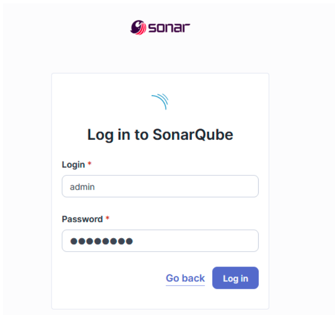
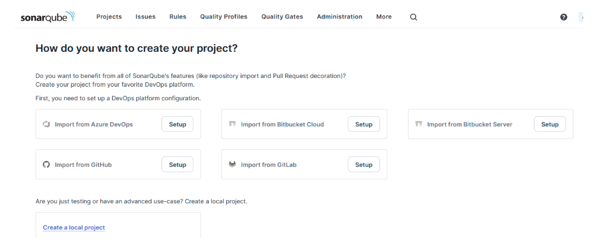
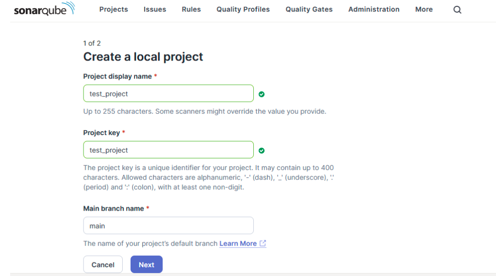
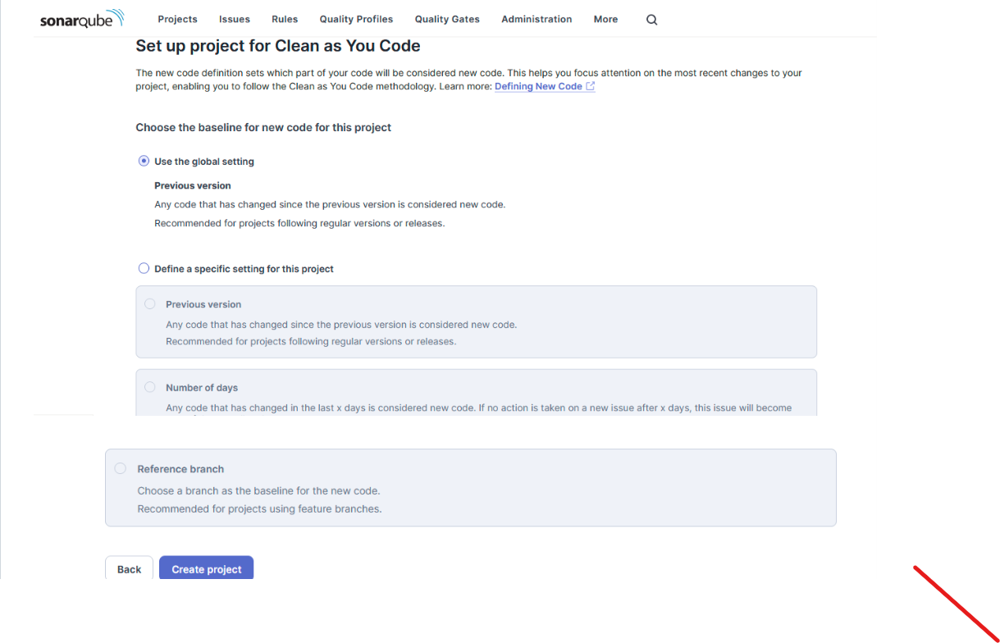
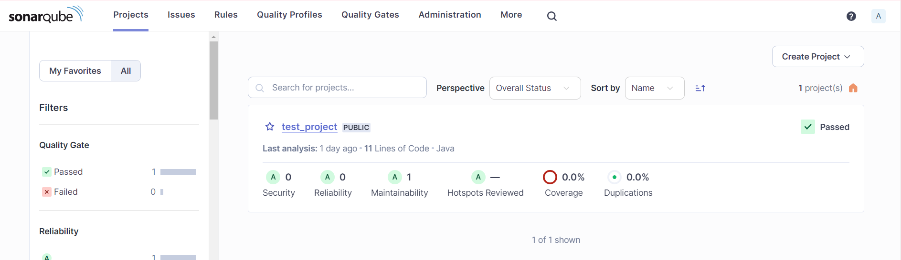
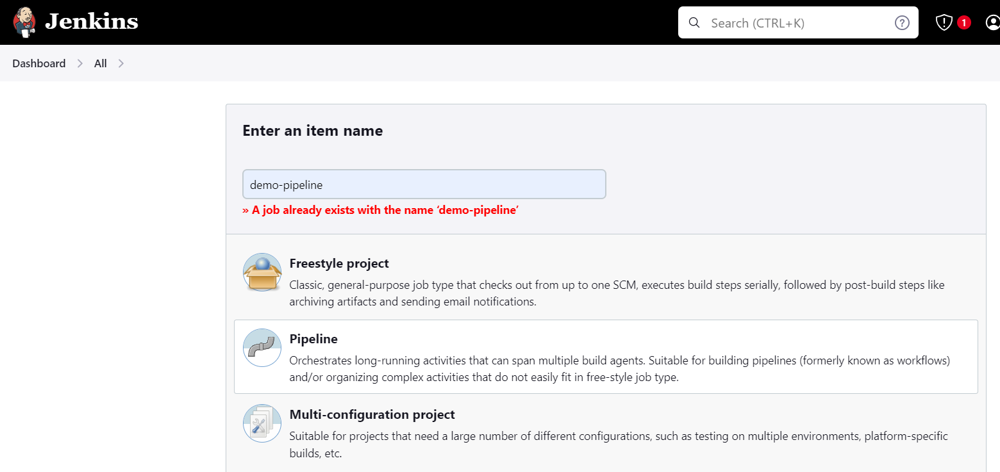
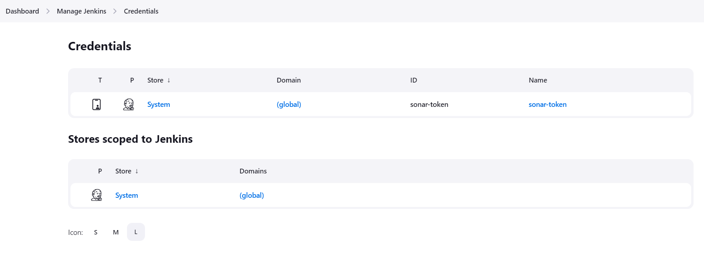

###
Scenario:
### 
#### 1. create a release pipeline where we need to get all branches from git repo and dynamically populate to user to select required branch and build the pipeline 
#### 2.  using sonarqube api get sonar check status , if sonar check passed then only continue the build otherwise fail the build

Install Java on aws linux

    sudo dnf install java-17-amazon-corretto-devel -y

Install jenkins on server

    sudo wget -O /etc/yum.repos.d/jenkins.repo https://pkg.jenkins.io/redhat-stable/jenkins.repo
    sudo rpm --import https://pkg.jenkins.io/redhat-stable/jenkins.io-2023.key

    sudo yum install jenkins
    sudo systemctl enable jenkins
    sudo systemctl start jenkins
    sudo systemctl status jenkins

    sudo cat /var/lib/jenkins/secrets/initialAdminPassword

### take another linux machine to install sonarqube 

    cd /opt
    sudo wget https://binaries.sonarsource.com/?prefix=Distribution/sonarqube/sonarqube-10.4.1.88267.zip
    sudo unzip sonarqube-10.4.1.88267.zip
    cd sonarqube-8.0

    - create a sonar user
     sudo useradd sonar

provide passwordless authentication to sonar user

    sudo visudo    --> opens nano editor (vi, vim)
    #root    ALL=(ALL)       ALL
    sonar   ALL=(ALL)       NOPASSWD:ALL
    ctrl + x -> Y -> enter

start the sonar service

    cd /opt
    sudo chown -R sonar:sonar /opt/sonarqube-8.0

    sudo su - sonar
    cd /opt/sonarqube-8.0/bin/linux-x86-64/
    sudo bash sonar.sh start
    sudo bash sonar.sh status

open port in aws console of security group 
    
        [sonar@ip-172-31-20-171 linux-x86-64]$ sh sonar.sh start
        Starting SonarQube...
        Started SonarQube.

        - enable 9000 port in SG 
        - and access -> http://52.39.183.141:9000
        - login -> username=admin, password=admin
        - change admin password: admin123

        

step-by-step procedure to build pipeline

1. Install git within server or from jenkins tools

        sudo yum install -y

Login into sonar and create user

create a new project(test_project) for our code analysis report publish

  

  

  

create test_project repository

   
 
2. now create a pipeline job in jenkins with groovy script

    
    
        pipeline {
            agent any
                environment{
                    MAVEN = "${tool 'MAVEN3.9.6'}/bin/mvn"
                }
                stages {
                stage('Checkout') {
                    steps {
                        checkout scmGit(branches: [[name: '*/main']], extensions: [], userRemoteConfigs: [[url: 'https://github.com/bhargavich18/java-maven-SampleWarApp.git']])          
                        }
                }

            stage('Build') {
                    steps {
                        sh '$MAVEN clean package'
                    }
                }
            stage('SonarQube') {
                    steps {
                        sh '$MAVEN sonar:sonar
                    }
                }

                }

            }
But above script creates new repository in sonarqube and upload the report, so we required to upload it in test_project which is created before, so for that we go for sonar cli installation within jenkins

and we require sonar token so create token under account of sonarqube UI

    login to jenkins master server

    cd /opt/
    sudo wget https://binaries.sonarsource.com/Distribution/sonar-scanner-cli/sonar-scanner-cli-5.0.1.3006-linux.zip
    sudo unzip sonar-scanner-cli-5.0.1.3006-linux.zip

    - now we need to inform sonarscanner where our sonarqube is running(server ip, port, token etc..), because sonarscanner can run independently, in sonar.properties file we need to mention

    cd /opt/sonar-scanner-5.0.1.3006-linux/conf
    sudo vi sonar.properties
    -------------------------------------------------------------------------------------------------------
    #----- Default SonarQube server
    sonar.host.url=http://52.10.226.100:9000                	#this can be overriden at the command
    sonar.token=sqa_1e72010ca912043557aa2bb7e37e3696f3333  		 #this can be overriden at the command
    sonar.projectKey=test_project
    sonar.projectname=test_project
    sonar.sources=src/main/java          				#src location of project
    sonar.java.binaries=target/classes   				#target location of project
    --------------------------------------------------------------------------------------------------------

    chmod +x /opt/sonar-scanner-5.0.1.3006-linux/bin/sonar-scanner
    sudo chown -R jenkins:jenkins sonar-scanner-5.0.1.3006-linux/

    - we need to goto project directory(/var/lib/jenkins/workspace/ci-pr) and run sonar scanner from there where (src/main/java) (target/classes ) folders are present
    - sonar scanner location -> /opt/sonar-scanner-5.0.1.3006-linux/bin/sonar-scanner
    - so here we are using generic sonar scanner which can be used for maven,gradle,ant etc....

configure sonar-token within jenkins

and the pipeline script can be modified like below 

    pipeline {
        agent any
            environment{
                MAVEN = "${tool 'MAVEN3.9.6'}/bin/mvn"
            }
            stages {
            stage('Checkout') {
                steps {
                    checkout scmGit(branches: [[name: '*/main']], extensions: [], userRemoteConfigs: [[url: 'https://github.com/bhargavich18/java-maven-SampleWarApp.git']])          
                    }
            }

        stage('Build') {
                steps {
                    sh '$MAVEN clean package'
                }
            }
        stage('SonarQube') {
                steps {
                    sh '$MAVEN sonar:sonar -Dsonar.host.url=http://54.166.111.38:9000 -Dsonar.projectKey=test_project -Dsonar.projectName=test_project -Dsonar.sonar.login=sqa_37049bed61653ebd791b797074ed0603b96c5d6a'
                }
            }

            }

        }

and here we want to check the report status so we can get it by using below cmd

    
    curl -u "sqa_37049bed61653ebd791b797074ed0603b96c5d6a": "http://54.166.111.38:9000/api/qualitygates/project_status?projectKey=test_project"

and implement shell script to check status f the sonarqube report and add that in groovy so that t will check and proceed for next stages

    pipeline {
    agent any
        environment{
            MAVEN = "${tool 'MAVEN3.9.6'}/bin/mvn"
            SONAR_TOKEN = credentials('sonar-token')
            SONAR_HOST_URL = 'http://54.166.111.38:9000'
            SONAR_PROJECT_KEY = 'test_project'
            SONAR_PROJECT_NAME = 'test_project'
          }
        stages {
        stage('Checkout') {
            steps {
                checkout scmGit(branches: [[name: '*/main']], extensions: [], userRemoteConfigs: [[url: 'https://github.com/bhargavich18/java-maven-SampleWarApp.git']])          
                }
        }

	 stage('Build') {
            steps {
                sh '$MAVEN clean package'
            }
        }
	  stage('Run SonarScanner CLI on Maven project') {
            steps {
                sh '/opt/sonar-scanner-5.0.1.3006-linux/bin/sonar-scanner -		Dsonar.host.url="${SONAR_HOST_URL}" -Dsonar.token="${SONAR_TOKEN}" '
            }
        }

	  stage('Sonar status check') {
            steps {
                sh '''
		#!/bin/bash
                    echo "This is a shell script within a Jenkins pipeline stage"
                    response=$(curl -u "${SONAR_TOKEN}": "${SONAR_HOST_URL}/api/qualitygates/project_status?projectKey=${SONAR_PROJECT_KEY}")
                    project_status=$(echo "$response" | jq -r '.projectStatus.status')
                    echo "Project Status: $project_status"
                    if [ "$project_status" == "OK" ]; then
                        echo "Project Status is OK."
                    else
                        echo "Project Status is ERROR."
                    fi
		'''
            }
        }
	  stage('Deploy to next stages'){
  		steps {
			echo "this code is deployable"
		}
         
        }

    }
}
